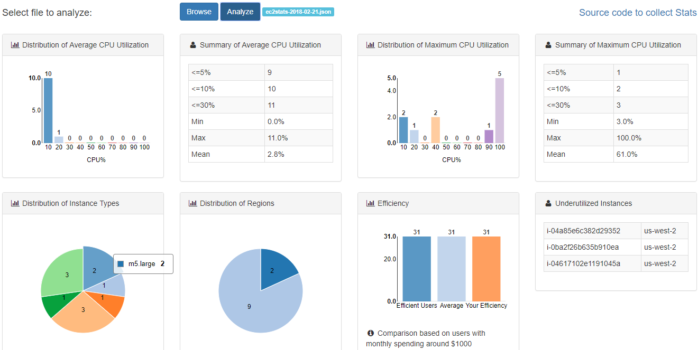

# awsstats
This tool collects AWS EC2 Cloudwatch stats of all EC2 instances in selected regions for the last two weeks and save them to a json file with a name such as ec2stats-2018-02-15.json.

    python e2stats.py -k YOUR_ACCESS_KEY -s YOUR_SECRET_ACCESS_KEY

It calls REST API to analyze the logs and the result will be printed on screen and saved as a json file with a name such as ec2summary-2018-02-15.

```
-----------------------------------Average CPU Utilization-----------------------------------
                    Distribution                    |                Summary
CPU%     : 10  20  30  40  50  60  70  80  90  100  | Min    Max    Mean   <=5%   <=10%  <=30%
Instances: 10  1   0   0   0   0   0   0   0   0    | 0.0%   11.0%  2.7%   9      10     11

-----------------------------------Maximum CPU Utilization-----------------------------------
                    Distribution                    |                Summary
CPU%     : 10  20  30  40  50  60  70  80  90  100  | Min    Max    Mean   <=5%   <=10%  <=30%
Instances: 2   1   0   2   0   0   0   0   0   6    | 3.0%   100.0% 62.5%  1      2      3

--------------------------------Distribution of Instance Types-------------------------------
t2.micro  :   3 | t2.small  :   3 | m5.large  :   2 | t2.large  :   1 | t2.medium :   1
t2.nano   :   1 |

-----------------------------------Distribution of Regions-----------------------------------
us-west-2 :   9 | us-east-2 :   2 |

-----------   Efficiency Compared to Users with Monthy Spending Around $1000      -----------
Your Efficiency     :      32 | Average             :      53 | Efficient Users     :      65

-------------------------Under-Utilized Instances: Avg<=5%, Max<=30%------------------------
i-04a85e6c382d29353 :us-west-2
i-0ba2f26b635b910e3 :us-west-2
i-04617102e11910453 :us-west-2
```

A better way to view the result is to visit https://customer.fittedcloud.com/v1/ec2stats and upload the ec2stats-xxxx-xx-xx.json file.



Other options:

    -a False: Skip analysis
    -v False: Turn off printing on screen
    -l fileName: Load existing stats file instead of collecting from Cloudwatch
    -t 5 10: Return under-utilized instance with Average CPU <= 5% and Maximum CPU <= 10%
    -c C:\Users\Bezos\.aws: Parent directory of aws config
    -p dev: profile

Here is example of the result of the analysis:

* Average: Analysis of average CPU utilization. It includes the number of instances with CPU less than 5%, 10%, and 30%. And the distribution of average CPU utilization.
* Maximum: Analysis of maximum CPU utilization. Similar to above.
* Efficiency: Efficiency score compared to other users.
* InstanceTypes: Instance types distribution.
* Regions: Distribution of instances across regions.
* UnderUtilized: List of under-utilized instances.
* Threshold: Threshold for Avg and Max CPU utilization for under-utilized instances.

```
    "Summary": {  
      "Average": {  
        "<=5%": 10,   
        "<=10%": 13,   
        "<=30%": 14,  
        "Min": "0.0%",   
        "Max": "15.0%",   
        "Mean": "3.2%",
        "Histogram": [  
          [  
            10,   
            13  
          ],   
          ...  
          [  
            100,   
            0  
          ]  
        ]  
      },   
      "Maximum": {  
        "<=5%": 1,   
        "<=10%": 2,   
        "<=30%": 7  
        "Min": "3.0%",   
        "Max": "100.0%",   
        "Mean": "54.8%",
        "Histogram": [  
          [  
            10,   
            2  
          ],   
          ...  
          [  
            100,   
            6  
          ]  
        ]  
      },   
      "InstanceTypes": [  
        [  
          "m4.xlarge",   
          1  
        ],   
        ...  
      ],
      "Regions": [
        [
          "us-west-2",
          3
        ]
        ...
      ],
      "UnderUtilized": [
        [
          "i-04a85e6c382d29353",
          "us-west-2"
        ]
        ...
      ],
      "Threshold": [
        {
          "Avg": 5,
          "Max": 30
        }
      ]
    }  
```


